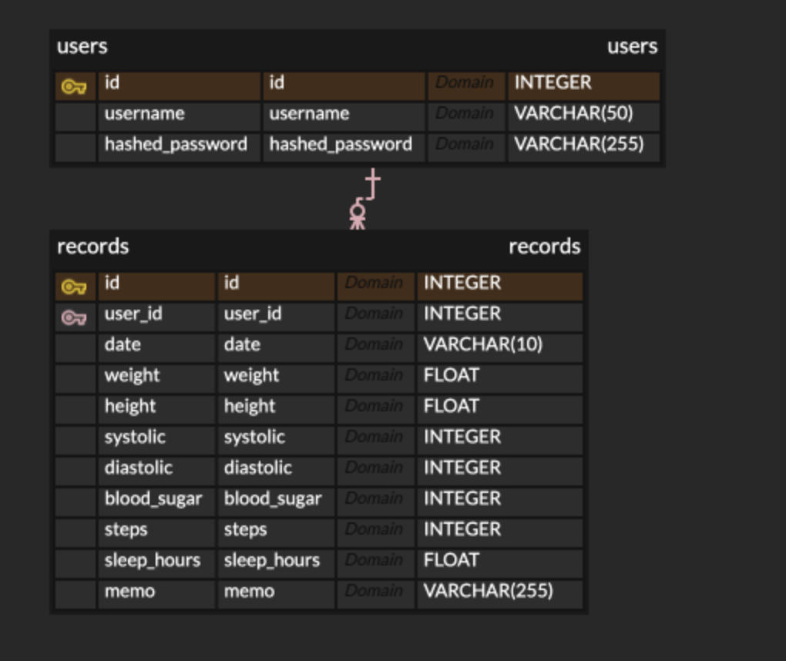
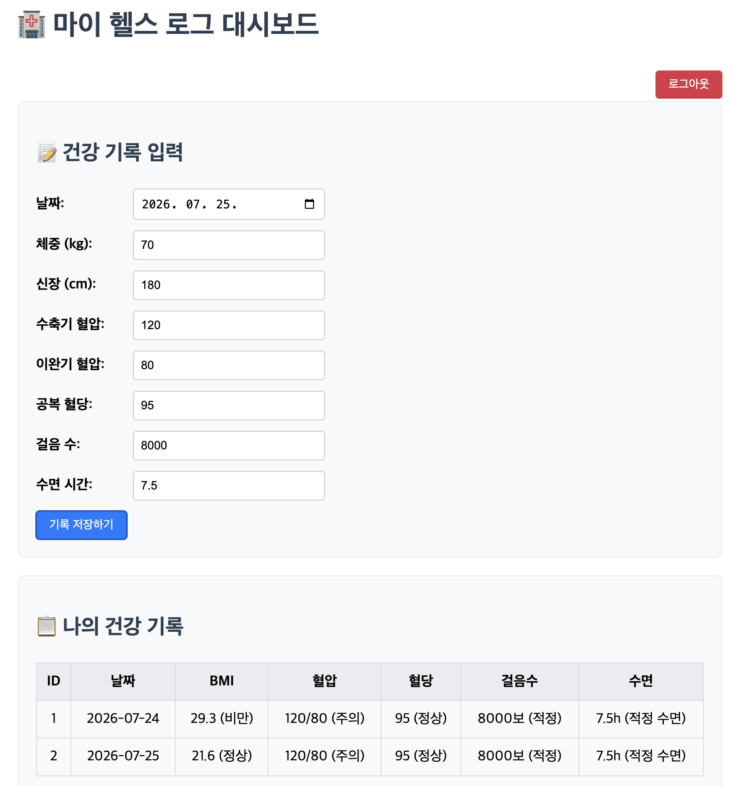

# 🏥 마이 헬스 로그 (My Health Log)

FastAPI와 SQLite를 활용하여 사용자의 일일 건강 데이터(체중, 혈압, 혈당, 운동량, 수면 시간)를 기록하고 지표를 자동 분석해 주는 웹 서비스입니다.

---

## 🌐 AWS 배포 서버 URL
* **대시보드 주소:** http://43.200.253.143:8000/dashboard

---

## 📌 주요 기능
* **회원가입 및 JWT 로그인**: Secure Password Hashing(PBKDF2) 및 JWT Token 기반 보안 인증
* **건강 기록 CRUD**: 날짜별 건강 상태 입력 및 개별 사용자 데이터 격리 저장
* **건강 지표 자동 계산**:
  * **BMI**: 신장/체중 기반 비만도 측정
  * **혈압**: 수축기/이완기 혈압 단계 판정 (정상/주의/고혈압)
  * **혈당**: 공복 혈당 수치 판정 (정상/공복혈당장애/당뇨 의심)
  * **활동량 & 수면**: 걸음 수 및 수면 시간 적정성 분석

---

## 🛠️ 기술 스택 (Tech Stack)
* **Backend**: Python 3.11, FastAPI, SQLAlchemy
* **Database**: SQLite3
* **Authentication**: Passlib (PBKDF2-SHA256), PyJWT
* **Infrastructure**: AWS Lightsail (Ubuntu), Docker
* **Frontend**: HTML5, JavaScript (Fetch API), CSS3

---

## 📐 DB 구조도 (ERD)

---

## 📄 요구사항 정의서 (PRD)
* 상세 요구사항은 [PRD.md](./PRD.md) 파일에서 확인하실 수 있습니다.

---

## 🖥️ 실행 화면 (Screenshots)
